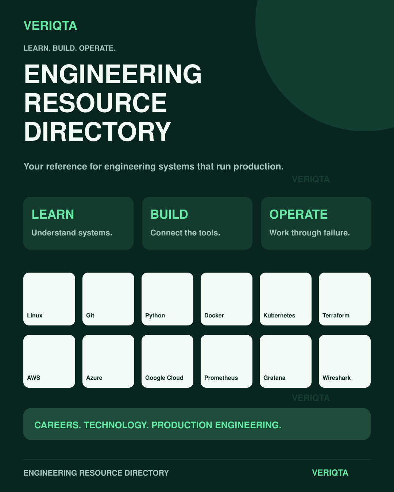
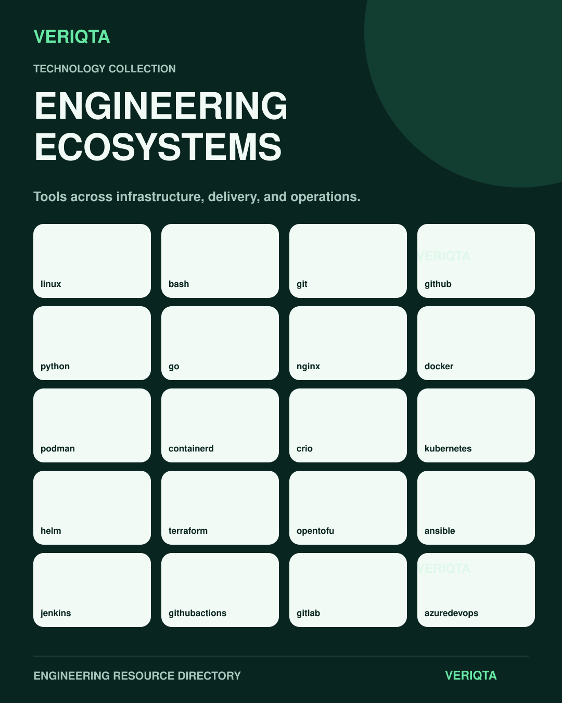
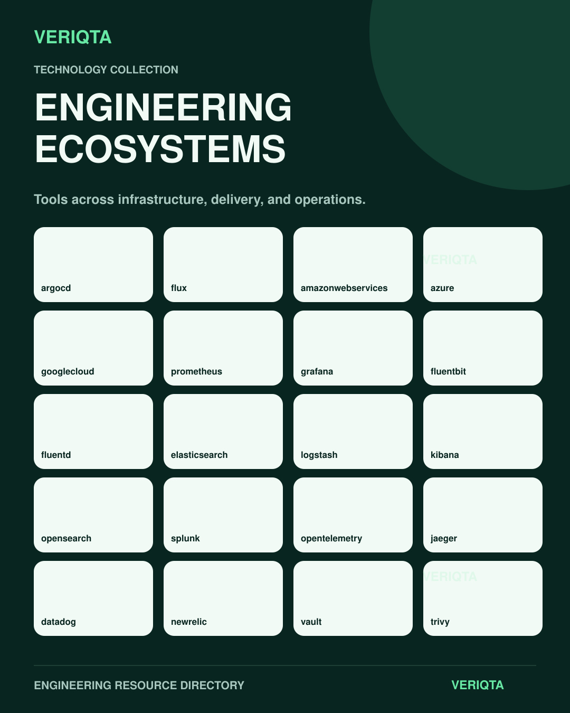
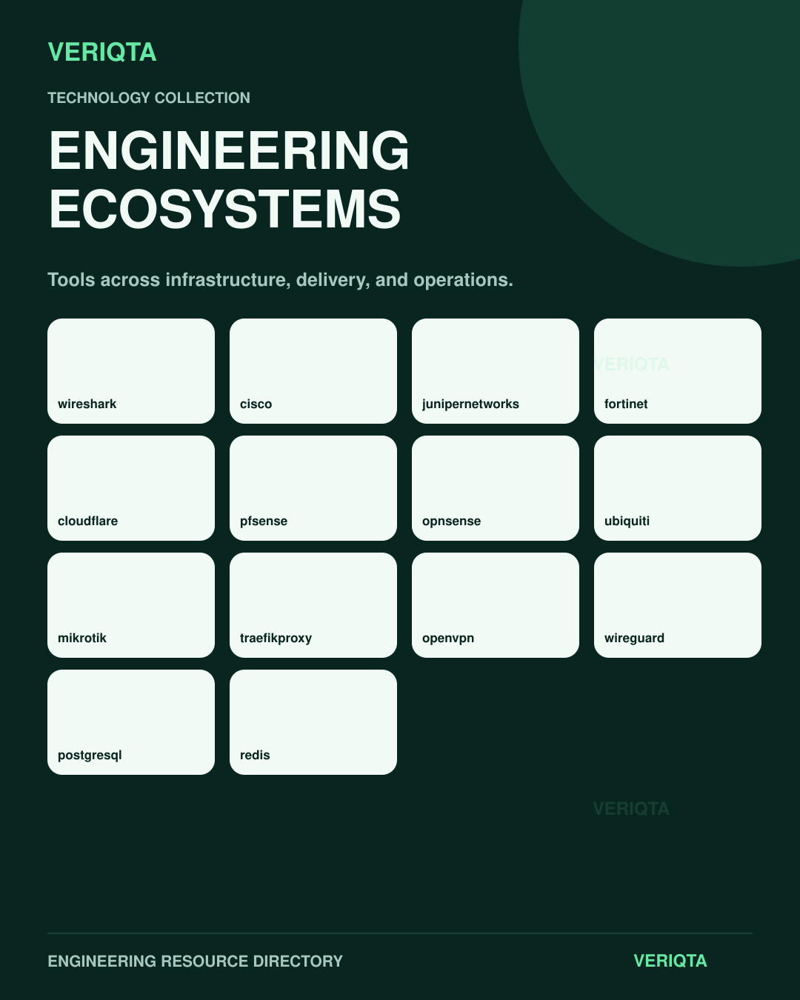
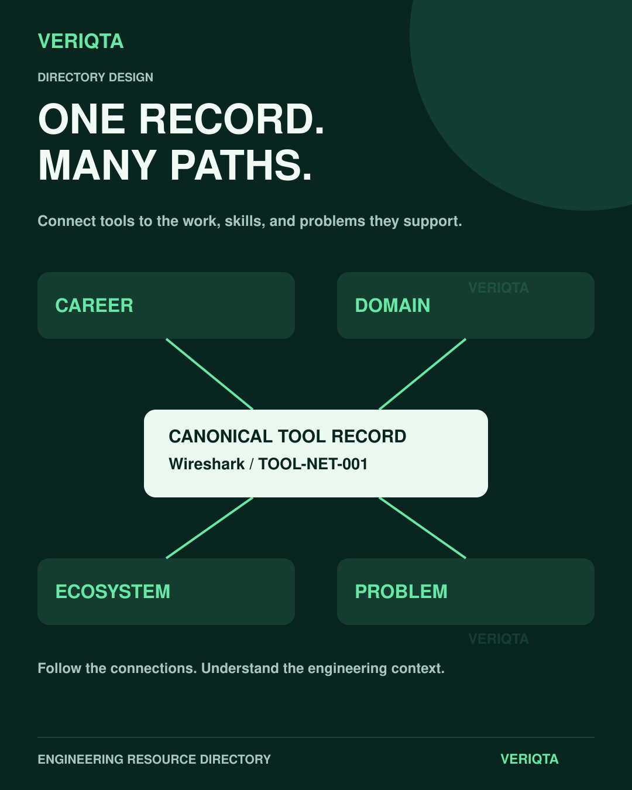
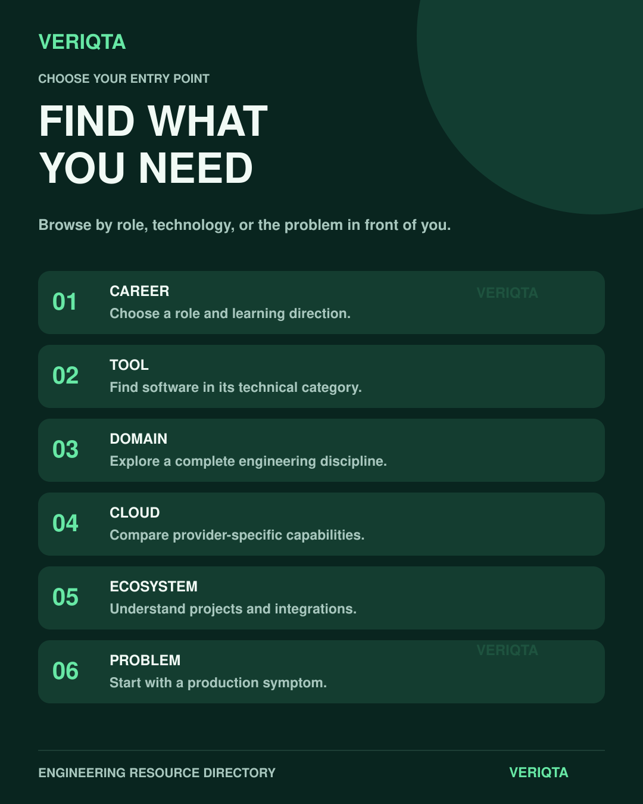

# VERIQTA Engineering Resource Directory

Engineering careers, tools, systems, and production practice in one connected reference.

[Start here](00-start-here/) · [Career paths](01-career-paths/) · [Tools](02-tools/) · [Technical domains](03-technical-domains/) · [Cloud](04-cloud-providers/) · [Production problems](06-production-problems/)

Explore the technologies behind modern engineering, understand how they fit together, and connect your learning to the work engineers perform. VERIQTA brings careers, technical disciplines, cloud platforms, architecture, and operational investigation into a single directory.

## Choose your route

| What you want to do | Where to begin |
| :--- | :--- |
| Understand an engineering role and its responsibilities | [Career paths](01-career-paths/) |
| Explore tools by the work they support | [Tools](02-tools/) |
| Study how a system or discipline works | [Technical domains](03-technical-domains/) |
| Compare cloud platforms and operating contexts | [Cloud providers](04-cloud-providers/) |
| Connect projects, integrations, and extensions | [Technology ecosystems](05-technology-ecosystems/) |
| Investigate an operational symptom | [Production problems](06-production-problems/) |

## Explore the catalogue

Linux and systems administration. Networking and packet analysis. Containers and Kubernetes. Infrastructure as code and automation. CI/CD and release engineering. Cloud and platform engineering. Security and DevSecOps. Metrics, logs, traces, and observability. Databases, messaging, storage, and recovery. Distributed systems, GPU infrastructure, MLOps, and AI operations.

Expand a subject below to browse its linked categories.

Career families

- [DevOps Delivery](01-career-paths/01-devops-delivery/)
- [SRE Reliability](01-career-paths/02-sre-reliability/)
- [Platform Engineering](01-career-paths/03-platform-engineering/)
- [Cloud Engineering](01-career-paths/04-cloud-engineering/)
- [Infrastructure](01-career-paths/05-infrastructure/)
- [Systems Administration](01-career-paths/06-systems-administration/)
- [Networking](01-career-paths/07-networking/)
- [Production Operations](01-career-paths/08-production-operations/)
- [Observability Performance](01-career-paths/09-observability-performance/)
- [CI/CD Release](01-career-paths/10-cicd-release/)
- [Automation](01-career-paths/11-automation/)
- [Security DevSecOps](01-career-paths/12-security-devsecops/)
- [Developer Infrastructure](01-career-paths/13-developer-infrastructure/)
- [Forward Deployed Field](01-career-paths/14-forward-deployed-field/)
- [Data Database Messaging](01-career-paths/15-data-database-messaging/)
- [Storage Recovery](01-career-paths/16-storage-recovery/)
- [Distributed Systems](01-career-paths/17-distributed-systems/)
- [Edge Traffic](01-career-paths/18-edge-traffic/)
- [Virtualization Datacenter](01-career-paths/19-virtualization-datacenter/)
- [Governance FinOps](01-career-paths/20-governance-finops/)
- [Service Management](01-career-paths/21-service-management/)
- [Incident Oncall](01-career-paths/22-incident-oncall/)
- [AI MLOps](01-career-paths/23-ai-mlops/)
- [Architecture](01-career-paths/24-architecture/)

Tool categories

- [AIOps](02-tools/aiops/)
- [Architecture](02-tools/architecture/)
- [Artifacts Packages](02-tools/artifacts-packages/)
- [Backup Disaster Recovery](02-tools/backup-disaster-recovery/)
- [Build Engineering](02-tools/build-engineering/)
- [CI/CD](02-tools/cicd/)
- [Cloud](02-tools/cloud/)
- [Configuration Management](02-tools/configuration-management/)
- [Containers](02-tools/containers/)
- [Data Config](02-tools/data-config/)
- [Databases](02-tools/databases/)
- [Datacenter Bare Metal](02-tools/datacenter-bare-metal/)
- [Debugging](02-tools/debugging/)
- [Documentation Diagramming](02-tools/documentation-diagramming/)
- [Edge CDN DNS](02-tools/edge-cdn-dns/)
- [FinOps](02-tools/finops/)
- [GitOps](02-tools/gitops/)
- [Hardware](02-tools/hardware/)
- [HPC](02-tools/hpc/)
- [Infrastructure As Code](02-tools/infrastructure-as-code/)
- [ITSM](02-tools/itsm/)
- [Kubernetes](02-tools/kubernetes/)
- [Messaging Streaming](02-tools/messaging-streaming/)
- [MLOps AI Infrastructure](02-tools/mlops-ai-infrastructure/)
- [Networking](02-tools/networking/)
- [Observability](02-tools/observability/)
- [Operating Systems](02-tools/operating-systems/)
- [Platform Developer Experience](02-tools/platform-developer-experience/)
- [Policy Governance](02-tools/policy-governance/)
- [Programming Scripting](02-tools/programming-scripting/)
- [Provisioning Images](02-tools/provisioning-images/)
- [Release Engineering](02-tools/release-engineering/)
- [Reliability Incident](02-tools/reliability-incident/)
- [Security](02-tools/security/)
- [Serverless PaaS](02-tools/serverless-paas/)
- [Service Mesh API](02-tools/service-mesh-api/)
- [Storage](02-tools/storage/)
- [Terminal Productivity](02-tools/terminal-productivity/)
- [Testing Performance](02-tools/testing-performance/)
- [Version Control](02-tools/version-control/)
- [Virtualization](02-tools/virtualization/)

Technical domains

- [Operating Systems Compute](03-technical-domains/01-operating-systems-compute/)
- [Computer Architecture Hardware](03-technical-domains/02-computer-architecture-hardware/)
- [Networking](03-technical-domains/03-networking/)
- [Programming Scripting](03-technical-domains/04-programming-scripting/)
- [Data Formats Configuration](03-technical-domains/05-data-formats-configuration/)
- [Version Control](03-technical-domains/06-version-control/)
- [Build Engineering](03-technical-domains/07-build-engineering/)
- [CI/CD](03-technical-domains/08-cicd/)
- [Release Engineering](03-technical-domains/09-release-engineering/)
- [Artifacts Packages](03-technical-domains/10-artifacts-packages/)
- [Infrastructure As Code](03-technical-domains/11-infrastructure-as-code/)
- [Configuration Management](03-technical-domains/12-configuration-management/)
- [Image Building Provisioning](03-technical-domains/13-image-building-provisioning/)
- [Virtualization](03-technical-domains/14-virtualization/)
- [Containers](03-technical-domains/15-containers/)
- [Kubernetes](03-technical-domains/16-kubernetes/)
- [GitOps](03-technical-domains/17-gitops/)
- [Cloud Computing](03-technical-domains/18-cloud-computing/)
- [Serverless PaaS](03-technical-domains/19-serverless-paas/)
- [Observability](03-technical-domains/20-observability/)
- [SRE Reliability](03-technical-domains/21-sre-reliability/)
- [Incident Management](03-technical-domains/22-incident-management/)
- [Production Debugging](03-technical-domains/23-production-debugging/)
- [Distributed Systems](03-technical-domains/24-distributed-systems/)
- [Databases](03-technical-domains/25-databases/)
- [Messaging Streaming](03-technical-domains/26-messaging-streaming/)
- [Storage](03-technical-domains/27-storage/)
- [Backup Disaster Recovery](03-technical-domains/28-backup-disaster-recovery/)
- [Security](03-technical-domains/29-security/)
- [Policy Governance](03-technical-domains/30-policy-governance/)
- [Platform Engineering](03-technical-domains/31-platform-engineering/)
- [Developer Infrastructure](03-technical-domains/32-developer-infrastructure/)
- [Service Mesh Networking](03-technical-domains/33-service-mesh-networking/)
- [API Infrastructure](03-technical-domains/34-api-infrastructure/)
- [Edge CDN DNS](03-technical-domains/35-edge-cdn-dns/)
- [FinOps](03-technical-domains/36-finops/)
- [Testing](03-technical-domains/37-testing/)
- [Performance](03-technical-domains/38-performance/)
- [Terminal Productivity](03-technical-domains/39-terminal-productivity/)
- [Documentation Knowledge](03-technical-domains/40-documentation-knowledge/)
- [Architecture System Design](03-technical-domains/41-architecture-system-design/)
- [Datacenter Bare Metal](03-technical-domains/42-datacenter-bare-metal/)
- [ITSM](03-technical-domains/43-itsm/)
- [MLOps](03-technical-domains/44-mlops/)
- [AI Gpu Infrastructure](03-technical-domains/45-ai-gpu-infrastructure/)
- [AIOps](03-technical-domains/46-aiops/)
- [HPC](03-technical-domains/47-hpc/)

Cloud providers and contexts

- [Akamai Cloud](04-cloud-providers/akamai-cloud/)
- [Alibaba Cloud](04-cloud-providers/alibaba-cloud/)
- [AWS](04-cloud-providers/aws/)
- [Azure](04-cloud-providers/azure/)
- [Bare Metal Cloud](04-cloud-providers/bare-metal-cloud/)
- [Cloud Comparison](04-cloud-providers/cloud-comparison/)
- [Cloudflare](04-cloud-providers/cloudflare/)
- [DigitalOcean](04-cloud-providers/digitalocean/)
- [Edge Cloud](04-cloud-providers/edge-cloud/)
- [Equinix](04-cloud-providers/equinix/)
- [Google Cloud](04-cloud-providers/google-cloud/)
- [Hetzner](04-cloud-providers/hetzner/)
- [Hybrid Cloud](04-cloud-providers/hybrid-cloud/)
- [IBM Cloud](04-cloud-providers/ibm-cloud/)
- [Multi Cloud](04-cloud-providers/multi-cloud/)
- [Nutanix](04-cloud-providers/nutanix/)
- [OpenShift](04-cloud-providers/openshift/)
- [OpenStack](04-cloud-providers/openstack/)
- [Oracle Cloud](04-cloud-providers/oracle-cloud/)
- [OVHcloud](04-cloud-providers/ovhcloud/)
- [PaaS](04-cloud-providers/paas/)
- [Scaleway](04-cloud-providers/scaleway/)
- [VMware Cloud](04-cloud-providers/vmware-cloud/)
- [Vultr](04-cloud-providers/vultr/)

Technology ecosystems

- [AI Infrastructure](05-technology-ecosystems/ai-infrastructure/)
- [Ansible](05-technology-ecosystems/ansible/)
- [Apache Foundation](05-technology-ecosystems/apache-foundation/)
- [API Gateways](05-technology-ecosystems/api-gateways/)
- [Argo](05-technology-ecosystems/argo/)
- [AWS](05-technology-ecosystems/aws/)
- [Azure](05-technology-ecosystems/azure/)
- [Backstage](05-technology-ecosystems/backstage/)
- [Ceph](05-technology-ecosystems/ceph/)
- [Chef](05-technology-ecosystems/chef/)
- [CI/CD](05-technology-ecosystems/cicd/)
- [Cilium](05-technology-ecosystems/cilium/)
- [Cloudflare](05-technology-ecosystems/cloudflare/)
- [CNCF](05-technology-ecosystems/cncf/)
- [Crossplane](05-technology-ecosystems/crossplane/)
- [Database](05-technology-ecosystems/database/)
- [DNS](05-technology-ecosystems/dns/)
- [Docker](05-technology-ecosystems/docker/)
- [Ebpf](05-technology-ecosystems/ebpf/)
- [Elastic](05-technology-ecosystems/elastic/)
- [Envoy](05-technology-ecosystems/envoy/)
- [FinOps](05-technology-ecosystems/finops/)
- [Flux](05-technology-ecosystems/flux/)
- [Git](05-technology-ecosystems/git/)
- [GitHub](05-technology-ecosystems/github/)
- [GitLab](05-technology-ecosystems/gitlab/)
- [Google Cloud](05-technology-ecosystems/google-cloud/)
- [Grafana](05-technology-ecosystems/grafana/)
- [Hashicorp](05-technology-ecosystems/hashicorp/)
- [Istio](05-technology-ecosystems/istio/)
- [Jenkins](05-technology-ecosystems/jenkins/)
- [Kafka](05-technology-ecosystems/kafka/)
- [Kubernetes](05-technology-ecosystems/kubernetes/)
- [Linux](05-technology-ecosystems/linux/)
- [Linux Foundation](05-technology-ecosystems/linux-foundation/)
- [MLOps](05-technology-ecosystems/mlops/)
- [Mysql](05-technology-ecosystems/mysql/)
- [Nats](05-technology-ecosystems/nats/)
- [Networking](05-technology-ecosystems/networking/)
- [Observability](05-technology-ecosystems/observability/)
- [Oci](05-technology-ecosystems/oci/)
- [Opensearch](05-technology-ecosystems/opensearch/)
- [OpenShift](05-technology-ecosystems/openshift/)
- [Openssf](05-technology-ecosystems/openssf/)
- [OpenStack](05-technology-ecosystems/openstack/)
- [OpenTelemetry](05-technology-ecosystems/opentelemetry/)
- [OpenTofu](05-technology-ecosystems/opentofu/)
- [Platform Engineering](05-technology-ecosystems/platform-engineering/)
- [PostgreSQL](05-technology-ecosystems/postgresql/)
- [Prometheus](05-technology-ecosystems/prometheus/)
- [Puppet](05-technology-ecosystems/puppet/)
- [Rabbitmq](05-technology-ecosystems/rabbitmq/)
- [Redis](05-technology-ecosystems/redis/)
- [Security](05-technology-ecosystems/security/)
- [Service Mesh](05-technology-ecosystems/service-mesh/)
- [SRE](05-technology-ecosystems/sre/)
- [Storage](05-technology-ecosystems/storage/)
- [Terraform](05-technology-ecosystems/terraform/)
- [VMware](05-technology-ecosystems/vmware/)
- [Windows](05-technology-ecosystems/windows/)

Production problem categories

- [AI Gpu](06-production-problems/ai-gpu/)
- [Application API](06-production-problems/application-api/)
- [CI/CD](06-production-problems/cicd/)
- [Cloud](06-production-problems/cloud/)
- [Containers](06-production-problems/containers/)
- [Databases](06-production-problems/databases/)
- [Distributed Systems](06-production-problems/distributed-systems/)
- [Edge DNS CDN](06-production-problems/edge-dns-cdn/)
- [Infrastructure As Code](06-production-problems/infrastructure-as-code/)
- [Kubernetes](06-production-problems/kubernetes/)
- [Messaging](06-production-problems/messaging/)
- [Networking](06-production-problems/networking/)
- [Observability](06-production-problems/observability/)
- [Platform Developer Experience](06-production-problems/platform-developer-experience/)
- [Security](06-production-problems/security/)
- [Storage Backup](06-production-problems/storage-backup/)
- [Systems](06-production-problems/systems/)

## Technology in context

Tools belong to systems. Explore the connections between source control, infrastructure, containers, delivery, observability, security, networking, and data services.

## Build your understanding

| Reference collection | Engineering purpose |
| :--- | :--- |
| [Documentation](07-documentation/) | Understand product behaviour, interfaces, configuration, and operating constraints. |
| [Learning resources](08-learning-resources/) | Explore books, courses, tutorials, labs, projects, and communities. |
| [Standards and RFCs](09-standards-and-rfcs/) | Study protocols, specifications, interoperability, and conformance. |
| [Reference architectures](10-reference-architectures/) | Examine dependencies, design choices, resilience, and trade-offs. |
| [Postmortems](11-postmortems/) | Follow incident evidence, contributing factors, and corrective actions. |
| [Indexes](12-indexes/) | Browse the directory through its reference indexes. |
| [Resource catalogue](13-resource-catalog/) | Explore resource categories and their engineering context. |
| [Templates](14-templates/) | Structure technical notes, architecture reviews, and incident analysis. |

## Work through a production problem

Begin with the symptom and user impact. Establish the system boundary, collect evidence, identify recent changes, and test a specific hypothesis. Compare possible actions, account for their impact, and verify recovery after the change.

Use controlled environments for practice. For production changes, establish authorization, assess the blast radius, define a rollback, and specify the evidence that will confirm success.

## Use the directory

1. Choose a career, subject, tool, or operational problem.
2. Follow the linked categories to narrow your focus.
3. Connect the technology to its dependencies and engineering purpose.
4. Check authoritative documentation and applicable standards.
5. Record your reasoning, test your understanding, and verify the result.

## Contribute

Suggest resources with a clear engineering purpose and supporting sources. Explain the intended audience, relevant technology, practical value, and relationship to existing entries.

[Contribution guide](CONTRIBUTING.md) · [Contributor guides](16-contributor-guides/) · [Resource standard](RESOURCE-STANDARD.md) · [Editorial standard](EDITORIAL-STANDARD.md) · [Quality assurance](15-quality-assurance/)

## Repository information

[Roadmap](ROADMAP.md) · [Changelog](CHANGELOG.md) · [Code of conduct](CODE_OF_CONDUCT.md) · [Security](SECURITY.md) · [Support](SUPPORT.md) · [License](LICENSE)

Directory maintenance

[Link verification policy](LINK-VERIFICATION-POLICY.md) · [Automation](17-automation-scripts/) · [Site and search](18-site-and-search/) · [Maintenance](19-maintenance/)

Technology names and logos belong to their respective owners. Their inclusion does not imply endorsement. [Technology logo sources](assets/logos/sources.json).
