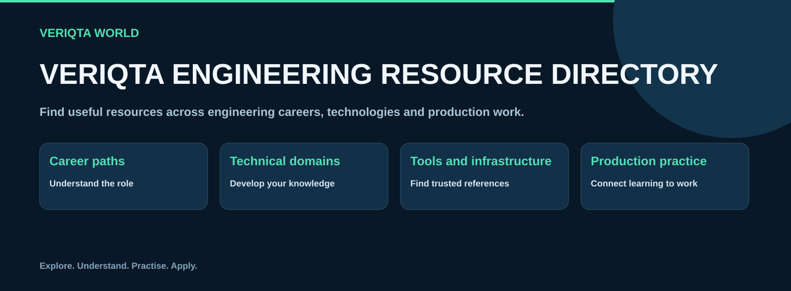
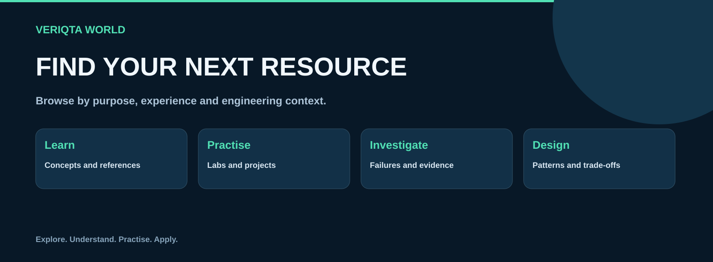
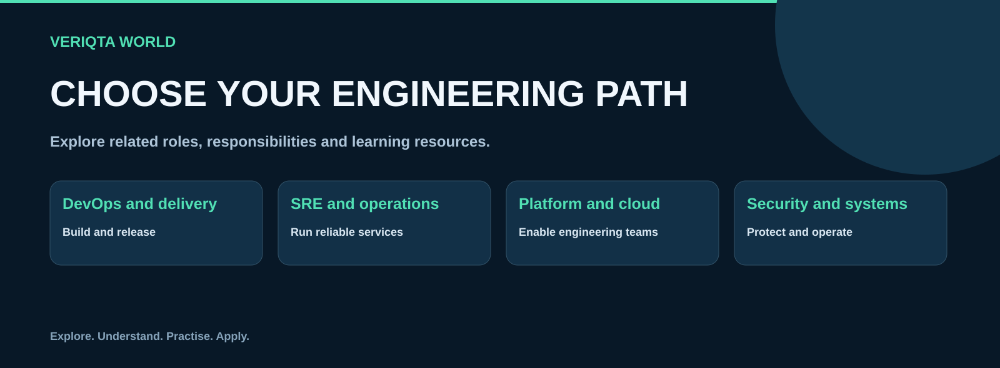
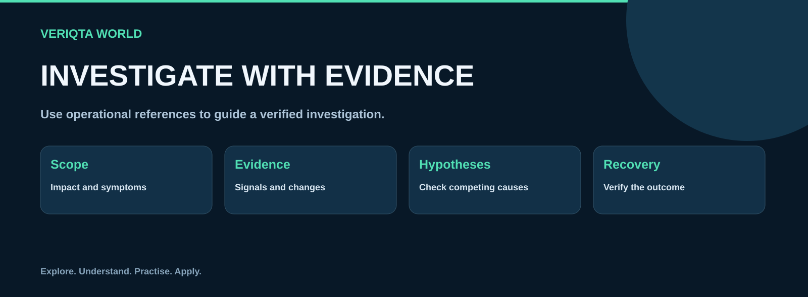
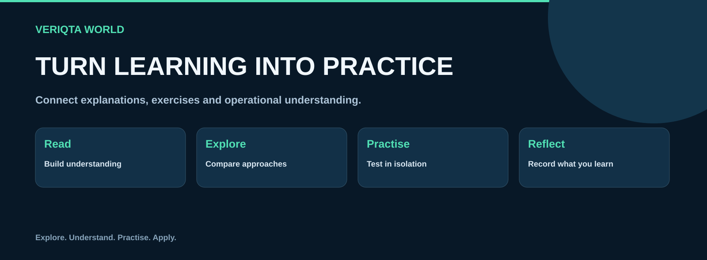
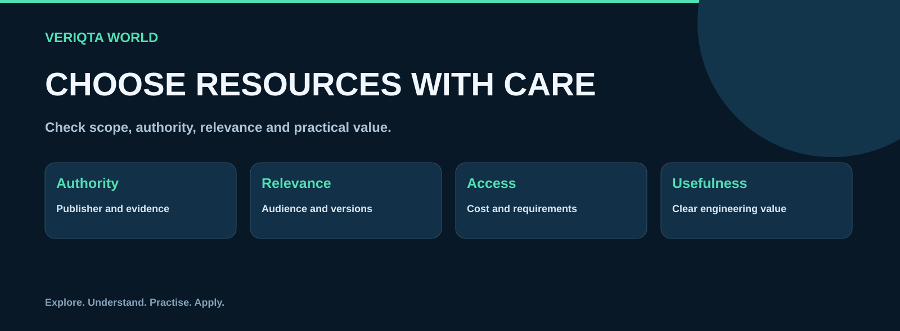

# VERIQTA Engineering Resource Directory

**Explore engineering careers, technical subjects, tools and production resources.**

[Start here](00-start-here) · [Explore careers](01-career-paths) · [Browse domains](02-engineering-domains) · [Find tools](03-tools-and-ecosystems) · [Investigate production problems](05-production-problems)

The VERIQTA Engineering Resource Directory connects engineering learning with practical work. Explore official documentation, learning materials, tools, labs, projects, architecture references and public incident reports across DevOps, SRE, platform engineering, cloud, infrastructure, security and related disciplines.

## Explore the directory

| Collection | What you can explore |
| --- | --- |
| [Start here](00-start-here) | Find your starting point and navigate engineering resources. |
| [Career paths](01-career-paths) | Explore engineering roles, skills and operational responsibilities. |
| [Engineering domains](02-engineering-domains) | Browse foundations and specialised engineering subjects. |
| [Tools and ecosystems](03-tools-and-ecosystems) | Explore tools, related technologies and official references. |
| [Cloud and infrastructure](04-cloud-and-infrastructure) | Find resources for cloud platforms, compute, networking and storage. |
| [Production problems](05-production-problems) | Find resources for investigating failures and verifying recovery. |
| [Learning and practice](06-learning-and-practice) | Discover books, courses, labs, projects and assessments. |
| [Architecture and reliability](07-architecture-and-reliability) | Explore system design, resilience and lessons from public incidents. |
| [Standards and documentation](08-standards-and-documentation) | Navigate authoritative documentation, specifications and frameworks. |
| [Resource indexes](09-resource-indexes) | Browse resources by role, experience, technology and format. |
| [Contributing and maintenance](10-contributing-and-maintenance) | Submit, review and maintain useful engineering resources. |

## Choose your starting point

- **Exploring a career:** review role responsibilities, skills and learning resources in the career paths.
- **Learning a subject:** browse the engineering domains for fundamentals and more specialised references.
- **Working with a technology:** find tools, ecosystems, cloud platforms and infrastructure resources.
- **Practising a skill:** explore labs, projects and assessment resources.
- **Investigating a failure:** use the production problem collections to focus your research and evidence gathering.
- **Designing a system:** explore architecture, reliability, standards and public incident lessons.

## Engineering career paths

Explore roles across software delivery, SRE, platform engineering, cloud, infrastructure, systems administration, networking, security, data systems, storage, incident response, AI infrastructure and architecture. Each role collection connects responsibilities with relevant skills, tools and learning opportunities.

[Browse the career paths](01-career-paths)

## Technical depth with clear navigation

Engineering domains bring together official documentation, fundamentals, subject-specific references, production patterns, labs, books, courses and interview resources. Kubernetes includes administration, networking, storage, security, observability and troubleshooting. Other domains use categories matched to their own engineering concerns.

[Explore engineering domains](02-engineering-domains)

## Connect learning with production work

Use production resources to understand failure patterns, compare investigative approaches and locate relevant references. Start with the impact and system context, collect evidence, test competing hypotheses and verify recovery. Apply recommendations within your environment’s access, review and change controls.

[Browse production problems](05-production-problems) · [Explore architecture and reliability](07-architecture-and-reliability)

## Learn through practice

Combine authoritative references with guided exercises and projects. Check prerequisites, use isolated environments, understand expected outcomes and clean up resources after practice. Develop the ability to explain your decisions and verify results.

[Explore learning and practice](06-learning-and-practice)

## Resource quality

A useful resource entry explains what it covers, who it suits, its prerequisites, access requirements and practical value. Check the publisher, relevant versions and date of review. Official references and community examples serve different purposes; evaluate both against the task and environment.

[Find official documentation and standards](08-standards-and-documentation)

## Contribute

Suggest resources, improve descriptions, correct broken links and help keep references relevant. Choose the appropriate collection and include enough context for readers to assess the resource.

[Read the contribution guide](CONTRIBUTING.md) · [Use the resource entry template](10-contributing-and-maintenance/resource-entry-template.md)

## About VERIQTA WORLD

VERIQTA WORLD shares engineering resources that help readers connect technical understanding with practical engineering work.

[Explore VERIQTA WORLD](https://github.com/VERIQTA-WORLD)

Resource links may lead to third-party services with their own access requirements and terms. Names and trademarks belong to their owners; inclusion does not imply affiliation or endorsement.
